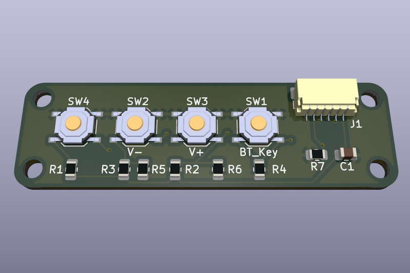
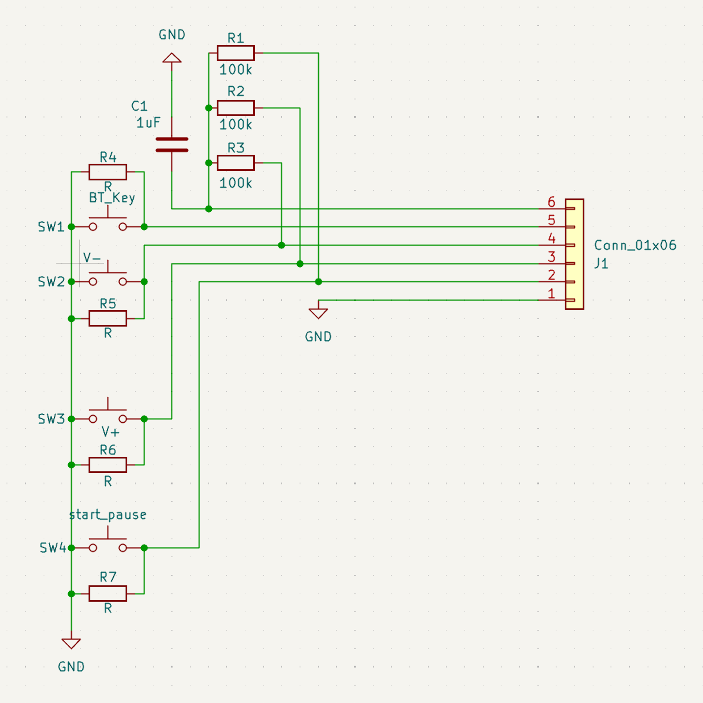
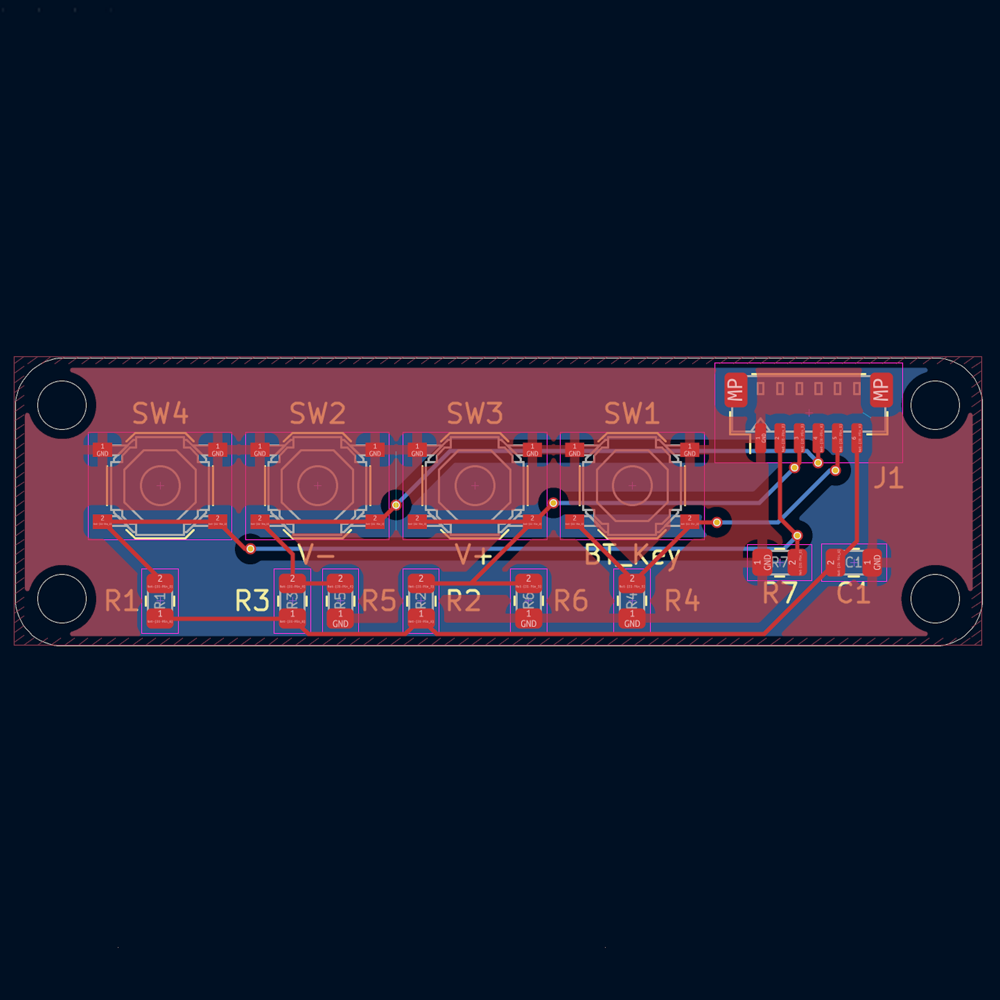
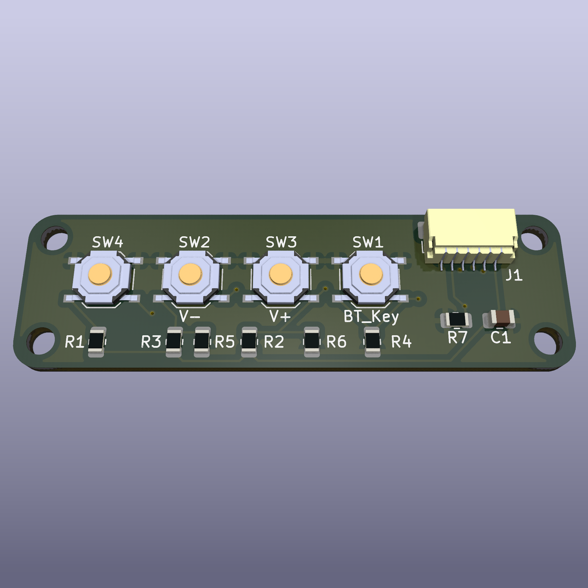

# 🎵 BluetoothSpeakerKeyboard

## 🚀 Overview

**Bluetooth Speaker Keyboard** is a minimalistic open-source PCB designed to provide simple control functionalities for Bluetooth speakers. The board features essential buttons for **volume control**, **Bluetooth pairing**, and **play/pause functionality**. It follows the **Adafruit-compatible footprint**, making it easy to integrate into existing projects.

## 🎯 Purpose
- 🔊 **Seamless audio control**: Easily manage volume, pairing, and playback.
- 🎛️ **Compact and efficient**: Designed for integration with Bluetooth speaker systems.
- 🛠️ **Open-source and customizable**: Modify the design to fit your specific needs.
- 🔌 **Adafruit-compatible**: Fits within Adafruit's standard PCB footprint for easy use in DIY projects.

## 📝 Features
| 🏷️ Feature        | 🔍 Description |
|----------------|-------------|
| 🔉 **Volume Control** | Adjust the speaker's volume up and down |
| 🔄 **Play/Pause Button** | Start or stop the music playback |
| 🔵 **Bluetooth Pairing Button** | Activate pairing mode for easy device connection |
| 🔧 **Minimalist Design** | Only essential components for simplicity |
| 🖥️ **PCB Design** | Open-source & customizable |
| 🌍 **Use Cases** | Embedded in DIY Bluetooth speakers, home automation systems |
| 🔌 **Adafruit-Compatible** | Follows Adafruit's standard PCB footprint |

## 📐 PCB Design Preview
| 📜 Schematic | 🖥️ PCB Layout | 🏗️ 3D |
|-----------|-----------|-----------|
|  |  |  |

## 🌟 License
This project is open-source. Feel free to use, modify, and contribute! 🚀
